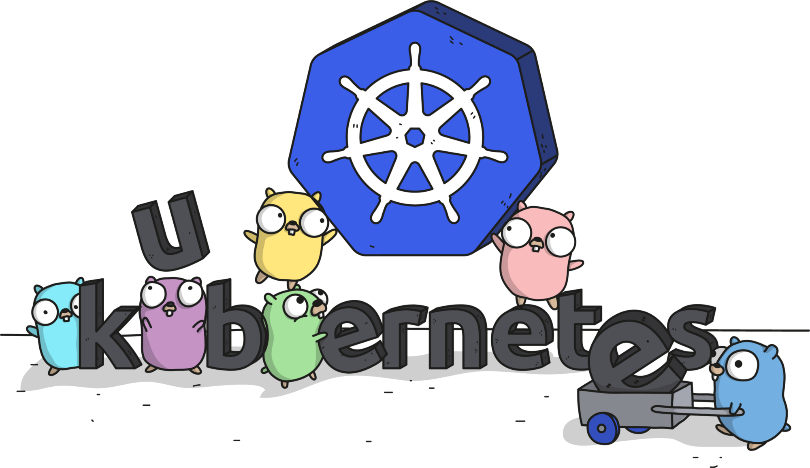

 

# Kubernetes Zero to Hero Projects

# Repository Introduction

This repository is a collection of Kubernetes projects that demonstrate how to use Kubernetes to deploy and manage applications in a multi-cloud infrastructure. The projects within this repository range from basic to advanced, making it a valuable resource for those looking to learn about Kubernetes from scratch, hence the repository's name "Zero to Hero." Some of the projects within this repository are designed to reflect real-world scenarios, providing a great opportunity for hands-on learning and experimentation with Kubernetes.

Not only is this repository a great resource for learning about Kubernetes, it is also open for correction and contribution. If you see any errors or have suggestions for improvement, I welcome your input. The background of this repository is my desire to give back to the community and help others learn about Kubernetes. Whether you are a seasoned Kubernetes user or just starting out, this repository has something to offer for everyone looking to gain practical experience with Kubernetes and contribute to its development."

# Prerequisites & Tech Stack

Each project has its own set of prerequisites & tech stack explain in README file in each of the projects directory. However, in general you will need to setup the following tech stack and prerequisites:

- A Workstation: To complete the project scenarios and manage the Kubernetes resources, you will need to have a workstation with `kubectl` installed. A personal laptop or PC is recommended, but not required. You can also use a virtual machine, tablet, phone, or any other device that allows you to connect to the Kubernetes cluster using `kubectl`. The installation process for `kubectl` will be explained in detail as one of the basic projects.
- A Kubernetes Cluster: In order to deploy and manage your applications, you will need to set up a Kubernetes cluster. A Kubernetes cluster is a group of machines, called nodes, that are used to run containerized applications. These nodes are connected to a shared network and are able to communicate with each other in order to facilitate the deployment and scaling of applications. You have the option to set up a Kubernetes cluster through a cloud provider, or you can use a tool such as Minikube for local development on your own machine. Either way, having a Kubernetes cluster is essential for utilizing the powerful features and capabilities of Kubernetes in your application development and deployment process.
In addition to the projects included in this repository, detailed instructions for installing and setting up a Kubernetes cluster will also be available as a basic project. These instructions will provide step-by-step guidance to ensure that you are able to successfully set up and configure your own Kubernetes cluster, whether in the cloud or on a local machine.
- An Application Docker Image: In order to deploy your application on a Kubernetes cluster, you will need to prepare a Docker image that contains your working application and all of its dependencies. This can be done by creating a Dockerfile and packaging your own application, or by using a publicly available application from DockerHub. For example, there are many open-source web applications with corresponding Docker images available on DockerHub, such as WordPress or Drupal. These images can be used as a starting point for your own application, or you can use them as-is if they meet your needs.

# How to Use the Projects

It is highly recommended that you start with the basic projects and work your way up to the intermediate and advanced ones. This will ensure that you have a solid foundation and can properly understand and make use of the more complex concepts. You have the option to either clone this entire project onto your local machine, allowing you to have all of the necessary files for hands-on practice at your fingertips, or you can choose to copy individual files as needed. In addition to following the instructions provided in the README file for each project, you may also find it helpful to refer to the articles published at geekinthecloud.xyz for more detailed steps and explanations. Some of the projects also have video references available for further guidance.

If you would like to publish or replicate this repository, we ask that you please give proper credit and mention this repository. It is always appreciated when others are able to learn and benefit from the hard work that has been put into creating these resources. Thank you for considering this request

# Projects List

## Basic Level Project

Before you can deploy an application to a Kubernetes cluster, you will need to install and set up the cluster itself. This can be done using a cloud provider or a tool such as Minikube for local development. The installation and setup process will vary depending on your chosen method, but it generally involves installing the necessary software and configuring the cluster to your specifications. 

Once the cluster is up and running, you can begin deploying applications to it. A common task in Kubernetes is to deploy a simple application, such as a web server, to a cluster. One way to do this is to create a Deployment resource, which manages a ReplicaSet of replicas of the application. The ReplicaSet ensures that a specified number of replicas of the application are running at any given time. 

To create the Deployment, you will need to specify the application's Docker image, the number of replicas you want to run, and any other relevant details such as environment variables or resource limits. You can then use the kubectl command-line tool to create and manage the Deployment.
Once the Deployment is up and running, you can use a Service resource to expose the application to the outside world. A Service defines a policy by which a set of replicas can be accessed, and it can be accessed using a stable IP address or hostname.

This is just one example of a basic Kubernetes project, but it illustrates the power and flexibility of the platform. With Kubernetes, you can deploy and manage applications at scale, with the ability to easily roll out updates and handle failures. Whether you are deploying a simple web server or a complex microservices architecture, Kubernetes has the tools and features you need to succeed.

A basic level Kubernetes project would typically involve learning how to use the **`kubectl`** command-line tool to manage Kubernetes resources. **`kubectl`** is the primary way to interact with a Kubernetes cluster, and it allows you to perform tasks such as deploying applications, inspecting cluster resources, and rolling out new updates.

### Environment Preparation

- [Setup Kubernetes Cluster On Local Machine With Minikube](./basic/setup-k8s-minikube.md)
- [Setup Kubernetes Cluster On Local Machine using Microk8s](./basic/setup-k8s-microk8s.md)
- [Setup Kubernetes Cluster On GCP Using GKE (Google Kubernetes Engine)](./basic/setup-k8s-gke.md)
- [Setup Kubernetes Cluster On AWS Using EKS (Elastic Container Service)](./basic/setup-k8s-eks.md)
- [Setup Kubernetes Cluster On Azure AKS ( Azure Kubernetes Service)](./basic/setup-k8s-aks.md)
- [Kubectl Installation](./basic/install-kubectl.md)
- [Setup kubectl context to Connect to Kubernetes Cluster](./basic/setup-kubctl-context.md)

### Basic Knowledge
- [Kubernetes Terminology](./basic/terminologies.md)
- [Brief Introduction of YAML](./basic/intro-to-yaml.md)
- Introduction kubectl command

### Basic Kubernetes Resource

- Exploring Cluster
- Exploring Nodes
- Exploring Namespace
- Exploring Pod
- Exploring Deployment
- Exploring Service

### Basic Project

- Deploy a simple application using a Kubernetes manifest file
- Controlling and Troubleshooting Existing Resource in Kubernetes
- Manipulating Existing Resource in Kubernetes
- Scaling Existing Resource in Kubernetes

## Intermediate Level Projects

A common requirement in cloud-native applications is the ability to store and retrieve data. In Kubernetes, this can be achieved through the use of persistent volumes and persistent volume claims. 

A persistent volume is a piece of storage in the cluster that has been provisioned by an administrator, and it can be used by pods to store data that needs to persist across pod restarts. A persistent volume claim is a request for storage by a user, and it allows a pod to access a specific persistent volume.

To use persistent storage in your Kubernetes applications, you will need to create a persistent volume and a persistent volume claim. You can then mount the persistent volume claim to a specific path in your application's pod, allowing it to access and store data on the persistent volume.

In addition to these native Kubernetes features, you can also integrate with third-party storage solutions such as Amazon Web Services (AWS) Elastic Block Store (EBS) or Google Cloud Platform (GCP) Persistent Disk. This can be useful if you want to use a specific storage provider or if you need to access storage that is not available in your cluster. 

This is just one example of an intermediate Kubernetes project, but it demonstrates the power of the platform to provide advanced features for cloud-native applications. With Kubernetes, you can build highly available and scalable applications that can store and retrieve data in a reliable and efficient manner, with the added flexibility of being able to integrate with third-party storage solutions.

### Intermediate Kubernetes Resource

- Exploring DaemonSets, StatefulSets, and ReplicaSets
- Exploring Jobs and CronJobs
- Exploring ConfigMap and Secret
- Exploring Port-Fowarding and Endpoint
- Exploring Ingress
- Exploring Persistent Volume, Persistent Volume Claim, and Storage Classes
- Exploring Horizontal Pods Autoscaller

### Intermediate Project

- Deploying Application to Specific Node
- Deploying a Microservices Application to Kubernetes
- Deploying a Multi-Tier Application (App + Database) To Kubernetes
- Integrate GCP Persistent Disk as a Kubernetes Persistent Volume
- Connect to External Database from an Application in Kubernetes
- Migrating Resource to Another Node Pool
- Upgrading Google Kubernetes Engine Cluster and Node Pool Without Downtime
- Implement AutoScaling in Kubernetes
- Integrating StatefulSet and PersistentVolumeClaim to manage Statefull Application

## Advanced Level Projects

A common challenge in modern software development is the need to integrate multiple systems and platforms in order to build a complete solution. This can be especially challenging in the context of Kubernetes, where you may be working with a complex network of containerized applications, microservices, and APIs. 

One example of an advanced Kubernetes project might be the deployment of a cloud-native e-commerce platform. This platform might include a web application, a database, a message queue, and multiple microservices that handle tasks such as payment processing and inventory management. Each of these components would need to be deployed to the cluster and integrated with one another in order to function correctly. 

To achieve this level of integration, you might need to use a variety of Kubernetes features and tools, such as Deployments, Services, ConfigMaps, and Secrets. You might also need to integrate with third-party services such as databases, message brokers, and cloud storage providers. Managing all of these components and integration points can be a complex task, but it is one that is made much simpler by the powerful features and capabilities of Kubernetes.

This example illustrates the real-world complexity that can be addressed with Kubernetes. By leveraging the platform's ability to manage and orchestrate containerized applications at scale, you can build highly available, scalable, and reliable systems that can handle the demands of modern software development.

### Tools & Tech

- Introduction to Helm
- Introduction to Flux
- Introduction to Spinaker
- Introduction to ArgoCD
- Introduction to Vault

### Advanced Kubernetes Resource

- Exploring Security Resources
- Exploring Policy Resourcess
- Exploring CRDs

### Advanced Projects

- Service mesh and networking with Istio
- Custom resource definitions and operator patterns
- Security and RBAC
- Multi-cluster and hybrid deployment scenarios
- Implementing GitOps Deployment with Flux and Helm
- Implementing GitOps Deployment with Spinaker and Helm
- Implementing GitOps Deployment with ArgoCD and Helm
- Integrating External Secret Manager to Microservices

# End Words

We hope that this repository has been helpful in your learning journey with Kubernetes. Whether you are just starting out or you are an experienced user, we hope that you have found something of value here. We welcome any feedback, corrections, or contributions to the repository, so please don't hesitate to reach out or open a pull request if you have something to share. Thank you for visiting, and happy learning!
