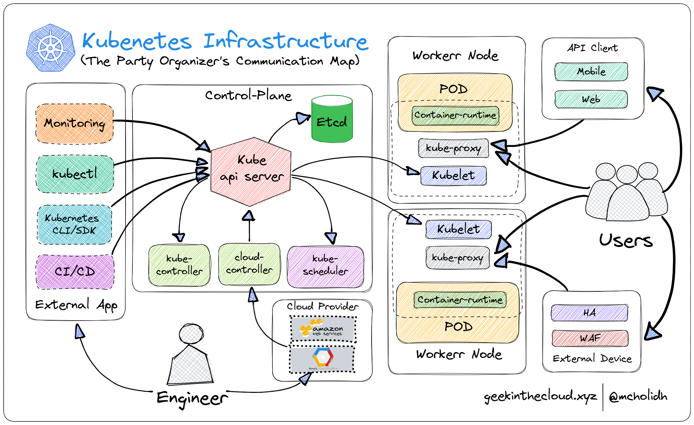

 

# Kubernetes Zero to Hero Party

# Welcome to the Kubernetes Repo-Story

<aside>
🃏 Where it’s more like a content from a story teller than an IT Architect, haha. Sorry not sorry.

</aside>

Greetings, fellow Kubernetes aficionado! Are you tired of feeling lost in the vast sea of Kubernetes information out there? Well, I, KubeGeek, have some exciting news for you. I have scoured the internet and hand-picked the most comprehensive collection of Kubernetes projects that will take you from a Kubernetes newbie to a seasoned pro in no time.

This repository, cleverly named "Zero to Hero," is jam-packed with projects that range from the basics to the advanced. Whether you're a developer looking to deploy your first application on a cluster, or a DevOps engineer looking to expand your Kubernetes skills, this repository has something for everyone.

But I didn't just stop at compiling a bunch of projects, oh no. I made sure to include real-world scenarios, so you can not only learn about Kubernetes, but also get your hands dirty and experiment with it. Trust me, there's nothing like deploying a real application on a cluster to solidify your understanding.

And the best part? This repository is open for contribution and correction. So if you spot any errors or have suggestions for improvement, don't be shy to speak up. My goal with this repository is to give back to the community and help others learn about Kubernetes, whether you're just starting out or a seasoned pro. I've also included some fun anecdotes and real-life examples to keep things interesting and relatable. So come join me on this Kubernetes journey, and let's make it a fun and fulfilling experience for everyone!

# How to Join The Party?

Kubernetes enthusiasts! Are you ready to join the party and learn all about Kubernetes?

First things first, before you join the party, it's important to have the right tools and knowledge. It's highly recommended that you start with the basic projects and work your way up to the intermediate and advanced ones. This will ensure that you have a solid foundation and can properly understand and make use of the more complex concepts.

Once you're ready to start, you have the option to either clone this entire project onto your local machine, allowing you to have all of the necessary files for hands-on practice at your fingertips, or you can choose to copy individual files as needed. In addition to following the instructions provided in the README file for each project, you may also find it helpful to refer to the articles published at geekinthecloud.xyz for more detailed steps and explanations. Some of the projects also have video references available for further guidance.

And just like a party, it's always more fun when you bring your friends along. If you would like to publish or replicate this repository, we ask that you please give proper credit and mention this repository. It's always appreciated when others are able to learn and benefit from the hard work that has been put into creating these resources.

So, grab your party hat and let's get started! With the right tools and knowledge, you'll be a Kubernetes pro in no time. And don't forget to have fun and enjoy the party!

# The Party Checklist:

<aside>
💡 What you need to know before taking off

</aside>

As a Kubernetes geek, I know that setting up the tech stack and prerequisites for a project can be a bit overwhelming, but don't worry, I'm here to make it as easy as possible for you.

## Kubernetes Cluster : The Party Ground

> Where all the Kubernetes component would dance around.
> 
- First things first, you're going to need a workstation. Now, I know some of you might be thinking "But KubeGeek, I don't have a fancy computer!" Well, fear not my friend, because a personal laptop or PC is recommended, but not required. You can use a virtual machine, tablet, phone, or any other device that allows you to connect to the Kubernetes cluster using **`kubectl`**. The installation process for **`kubectl`** will be explained in detail as one of the Party Ground Preparation, so don't worry about that.
- Next up, you're going to need a Kubernetes cluster. A Kubernetes cluster is like the backbone of your project, it's a group of machines, called nodes, that are used to run containerized applications. These nodes are connected to a shared network and are able to communicate with each other in order to facilitate the deployment and scaling of applications. You have the option to set up a Kubernetes cluster through a cloud provider, or you can use a tool such as Minikube for local development on your own machine. Either way, having a Kubernetes cluster is essential for utilizing the powerful features and capabilities of Kubernetes in your application development and deployment process. And don't worry, detailed instructions for installing and setting up a Kubernetes cluster will also be available as a basic project. These instructions will provide step-by-step guidance to ensure that you are able to successfully set up and configure your own Kubernetes cluster, whether in the cloud or on a local machine.

### Party Ground Options

Alright party people, before we can get the party started, we need to choose the perfect party ground, a battlefield for our party members if you will. And as a Kubernetes geek, I have some recommendations for you.

- First up, we have the option of using a cloud provider for our party ground. This is a great option for those who want to have a larger party and don't want to worry about the logistics of setting up and maintaining the party ground themselves. Some popular cloud providers for hosting a Kubernetes party include AWS, Google Cloud, and Azure. Just make sure to read the fine print and choose the provider that best fits your party needs.
- Next, we have the option of using a tool such as Minikube for a more intimate, local development party. Minikube is a great option for those who want to host a smaller party and have more control over the party ground setup. It is easy to set up and use and you can even do it on your own machine if you want to.
- And last but not least, we have the option of using a bare-metal server for our party ground. This is a great option for those who want full control and flexibility over the party ground and don't mind getting their hands dirty with the setup process.

No matter which option you choose, detailed instructions for setting up and configuring your party ground will be available in Party Ground Setup Instruction. These instructions will provide step-by-step guidance to ensure that your party ground is ready for the ultimate Kubernetes party. So, choose your battle ground wisely, and let's get this party started!

### Party Ground Setup

[Setup Kubernetes Cluster On Local Machine With Minikube](./basic/setup-k8s-minikube.md)

[Setup Kubernetes Cluster On Local Machine using Microk8s](./basic/setup-k8s-microk8s.md)

[Setup Kubernetes Cluster On GCP Using GKE (Google Kubernetes Engine)](./basic/setup-k8s-gke.md)

[Setup Kubernetes Cluster On AWS Using EKS (Elastic Kubernetes Service)](./basic/setup-k8s-eks.md)

[Setup Kubernetes Cluster On Azure AKS ( Azure Kubernetes Service)](./basic/setup-k8s-eks.md)

[Setup Kubernetes Cluster The Hard Way (On-Premises)](#)

[Setup Kubernetes Cluster on Hybrid Environment](#)

## Docker Image: The Party Theme

Just like a party theme, a Docker image is a set of resources that are themed around a specific idea or concept. It includes all the resources needed to create a specific party atmosphere, such as decorations, music, and games.

A Docker image can be used to create a party atmosphere that is consistent and predictable, just like how a party theme does. It ensures that the resources that are needed for the party are available, and it guarantees that the resources will work in a consistent way.

Here’s a list of available public docker image that we can use:

1. Single-tier application:
    - Nginx: **[https://hub.docker.com/_/nginx](https://hub.docker.com/_/nginx)**
    - Redis: **[https://hub.docker.com/_/redis](https://hub.docker.com/_/redis)**
    - MongoDB: **[https://hub.docker.com/_/mongo](https://hub.docker.com/_/mongo)**
2. Multi-tier application:
    - WordPress: **[https://hub.docker.com/_/wordpress](https://hub.docker.com/_/wordpress)**
    - Magento: **[https://hub.docker.com/r/magento/magento](https://hub.docker.com/r/magento/magento)**
    - LAMP stack: **[https://hub.docker.com/layers/bitnami/lamp/](https://hub.docker.com/layers/bitnami/lamp/)**

## Kubectl : The Essential Party-Toolkit

Kubectl is like the ultimate party toolkit for managing your Kubernetes cluster. Just as a party organizer has a set of tools to organize and manage the party, that tools would be `kubectl`. It has a set of commands to organize and manage your Kubernetes resources.

With `kubectl`, you can create, update, and delete resources such as pods, services, and deployments, just like how a party organizer can create, update, and delete the party's menu, decorations, and entertainment. You can also use `kubectl` to check the status of your resources and troubleshoot any issues that may arise. `kubectl` also allows you to scale your resources.

In short, kubectl is an essential tool for managing and maintaining your Kubernetes cluster, and it's a must-have tool for any Kubernetes party enthusiast. So, don't wait any longer and add kubectl to your Kubernetes toolkit today, and let the party begin!

Now let’s get this Party-Toolkit ready!

[Kubectl Installation](./basic/install-kubectl.md)

[Setup kubectl context to Connect to Kubernetes Cluster](./basic/setup-kubectl-context.md)

[Introduction to kubctl command](./basic/kubectl-command.md)

# Inside The Party

Welcome to the Kubernetes party ground! This is a place where all the magic happens, where different applications and services come together to create a seamless and enjoyable experience.

Inside this party ground, you'll find different sections, each with their own unique role and purpose. Just like how a party ground would have different sections for music, socializing, and different type of foods, Kubernetes has different components and layers that work together to make the overall experience happen. 

Here’s some activity I recommend at the start of the party

## Explore the Party Ground Architecture

In short, party ground are divides into two area, master nodes and worker nodes. the master nodes or control plane are like the party's main control center. The staff only building where all the important decisions are made, while the worker nodes are like the smaller rooms where the guests are having a good time. Together, they work to ensure that the party is running smoothly and that all the guests (or resources) are having a good time. 

This is an example of how all the organizer, guest, and party participant are communicating.

 

Let’s talk to each of those component and resource in Kubernetes cluster

### Control Plane: Staff Only Building

<aside>
🃏 Where all the party organizer doing their job. This is actually a private area. However, with me here, I will guide and introduce you to everyone inside.

</aside>

[Talk to kube-apiserver: Head of The Party Organizer](./basic/kube-apiserver.md)

[Meet Controller Manager: The Party Organizer’s Manager](./basic/controller-manager.md)

[Scheduler: The Party’s Attendant](./basic/scheduler.md)

[Enter ETCD: The Database Room](./basic/etcd.md)

### Worker Node: The Open Party Ground

[Meet kubelet: The Party’s Helper](./basic/kubelet.md)

# Join The Party

Just like how a party starts with the basics and gradually becomes more advanced, learning Kubernetes follows the same pattern.

Imagine, at the beginning of the party, you start off with small talk, getting to know the other guests and setting the mood. In Kubernetes, this would be like learning the basics of containers and container orchestration. As the party progresses, you move on to dancing and having more fun, in Kubernetes, this would be like learning more advanced concepts such as scaling and self-healing.

By following this progression, you'll be able to fully understand and utilize the more advanced concepts, just as you would be able to fully enjoy and participate in the party as it progresses.

## Basic Level Party (Newbie)

At the basic level, you'll be introduced to the fundamentals of containers and container orchestration. This is like being introduced to the guests at the party and learning about their interests and background.

You'll learn about containerization and how it allows for applications to be packaged and deployed in a consistent and portable manner. This is like learning about the different types of food and drinks that will be served at the party and how they're prepared.

You'll also learn about container orchestration and how it allows for managing and scaling containerized applications. This is like learning about the entertainment and activities that will be provided at the party and how they're coordinated.

By understanding the basics, you'll have a solid foundation for learning more advanced concepts and fully participating in the Kubernetes party. So don't hesitate, join the party and have fun learning the basics of containers and container orchestration.

### Basic Knowledge

[Kubernetes Terminology](./basic/terminologies.md)

[Brief Introduction of YAML](./basic/yaml.md)

### Basic Kubernetes Resource

- Exploring Namespace
- Exploring Pod
- Exploring Deployment
- Exploring Service

### Basic Project

- Deploy a simple application using a Kubernetes manifest file
- Controlling and Troubleshooting Existing Resource in Kubernetes
- Manipulating Existing Resource in Kubernetes
- Scaling Existing Resource in Kubernetes

## Intermediate Level Projects

A common requirement in cloud-native applications is the ability to store and retrieve data. In Kubernetes, this can be achieved through the use of persistent volumes and persistent volume claims. 

A persistent volume is a piece of storage in the cluster that has been provisioned by an administrator, and it can be used by pods to store data that needs to persist across pod restarts. A persistent volume claim is a request for storage by a user, and it allows a pod to access a specific persistent volume.

To use persistent storage in your Kubernetes applications, you will need to create a persistent volume and a persistent volume claim. You can then mount the persistent volume claim to a specific path in your application's pod, allowing it to access and store data on the persistent volume.

In addition to these native Kubernetes features, you can also integrate with third-party storage solutions such as Amazon Web Services (AWS) Elastic Block Store (EBS) or Google Cloud Platform (GCP) Persistent Disk. This can be useful if you want to use a specific storage provider or if you need to access storage that is not available in your cluster. 

This is just one example of an intermediate Kubernetes project, but it demonstrates the power of the platform to provide advanced features for cloud-native applications. With Kubernetes, you can build highly available and scalable applications that can store and retrieve data in a reliable and efficient manner, with the added flexibility of being able to integrate with third-party storage solutions.

### Intermediate Kubernetes Resource

- Exploring DaemonSets, StatefulSets, and ReplicaSets
- Exploring Jobs and CronJobs
- Exploring ConfigMap and Secret
- Exploring Port-Fowarding and Endpoint
- Exploring Ingress
- Exploring Persistent Volume, Persistent Volume Claim, and Storage Classes
- Exploring Horizontal Pods Autoscaller

### Intermediate Project

- Deploying Application to Specific Node
- Deploying a Microservices Application to Kubernetes
- Deploying a Multi-Tier Application (App + Database) To Kubernetes
- Integrate GCP Persistent Disk as a Kubernetes Persistent Volume
- Connect to External Database from an Application in Kubernetes
- Migrating Resource to Another Node Pool
- Upgrading Google Kubernetes Engine Cluster and Node Pool Without Downtime
- Implement AutoScaling in Kubernetes
- Integrating StatefulSet and PersistentVolumeClaim to manage Statefull Application

## Advanced Level Projects

A common challenge in modern software development is the need to integrate multiple systems and platforms in order to build a complete solution. This can be especially challenging in the context of Kubernetes, where you may be working with a complex network of containerized applications, microservices, and APIs. 

One example of an advanced Kubernetes project might be the deployment of a cloud-native e-commerce platform. This platform might include a web application, a database, a message queue, and multiple microservices that handle tasks such as payment processing and inventory management. Each of these components would need to be deployed to the cluster and integrated with one another in order to function correctly. 

To achieve this level of integration, you might need to use a variety of Kubernetes features and tools, such as Deployments, Services, ConfigMaps, and Secrets. You might also need to integrate with third-party services such as databases, message brokers, and cloud storage providers. Managing all of these components and integration points can be a complex task, but it is one that is made much simpler by the powerful features and capabilities of Kubernetes.

This example illustrates the real-world complexity that can be addressed with Kubernetes. By leveraging the platform's ability to manage and orchestrate containerized applications at scale, you can build highly available, scalable, and reliable systems that can handle the demands of modern software development.

### Tools & Tech

- Introduction to Helm
- Introduction to Flux
- Introduction to Spinaker
- Introduction to ArgoCD
- Introduction to Vault

### Advanced Kubernetes Resource

- Exploring Security Resources
- Exploring Policy Resourcess
- Exploring CRDs

### Advanced Projects

- Service mesh and networking with Istio
- Custom resource definitions and operator patterns
- Security and RBAC
- Multi-cluster and hybrid deployment scenarios
- Implementing GitOps Deployment with Flux and Helm
- Implementing GitOps Deployment with Spinaker and Helm
- Implementing GitOps Deployment with ArgoCD and Helm
- Integrating External Secret Manager to Microservices

# End Words

We hope that this repository has been helpful in your learning journey with Kubernetes. Whether you are just starting out or you are an experienced user, we hope that you have found something of value here. We welcome any feedback, corrections, or contributions to the repository, so please don't hesitate to reach out or open a pull request if you have something to share. Thank you for visiting, and happy learning!